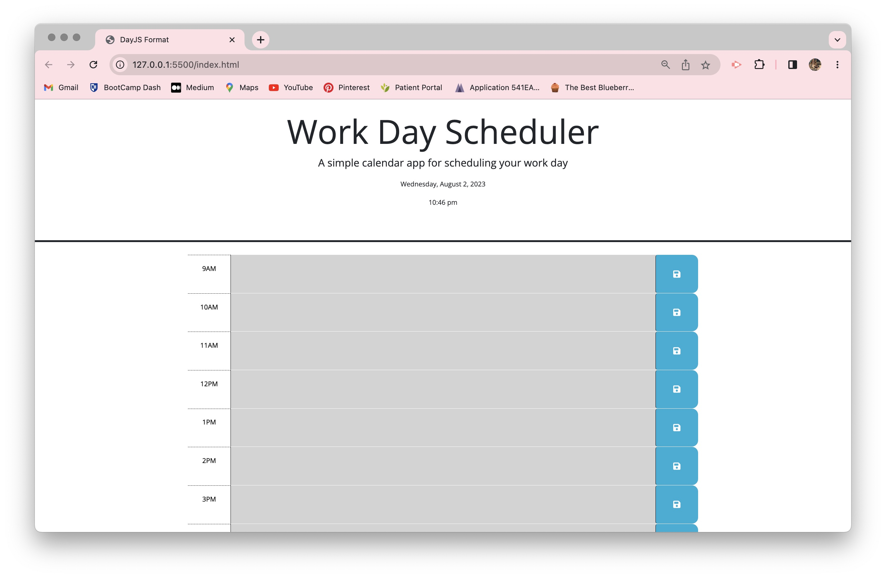

# danielles-work-day-scheduler
## Description
A work day scheduler to help plan your day. It is set during the most common work hours (9am-5pm). Not shown well in the photo attached, there are different colors for timeblocks to indicate past, present, and future.

## Installation
No installation necessary, can be accessed through any browser.

## Usage
This site is best used to plan your work day and even tracking your work day.
## License
N/A

## image

